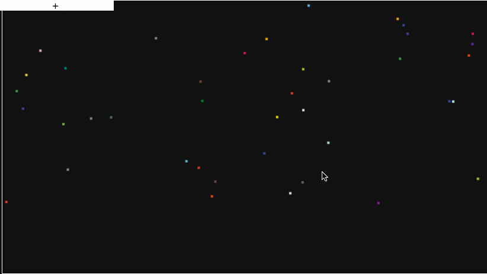
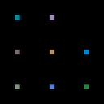
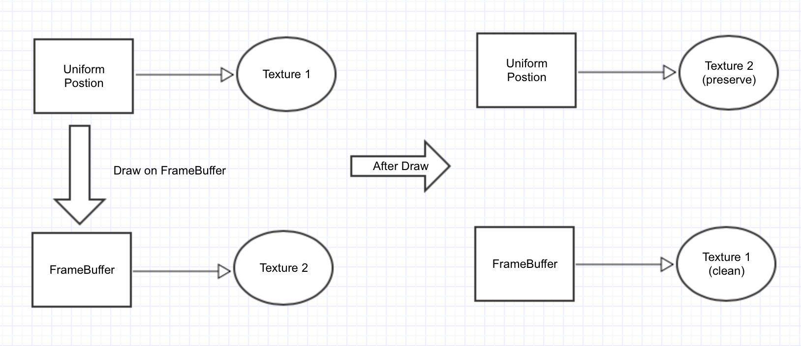
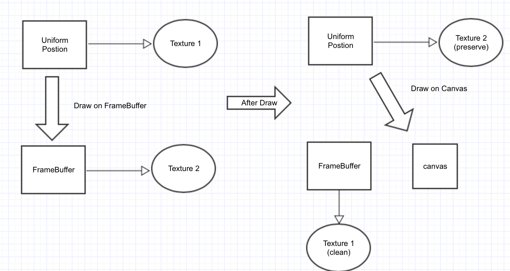

#陪你去看WebGL烟火
本文主要利用WebGL在FrameBuffer中进行高并发计算，需要一定的WebGL背景知识。



[网页中的Demo](https://brianzeng.github.io/webgl-particle-drawer/)简单地模拟了抛物运动，物体以一定的初速度抛出，受重力影响下落。随着时间的变化，物体的速度和位置都会发生变化。抛物运动的计算本身很简单，但是当有大量的粒子需要计算时，JS就不堪重负了。而GPU计算的特点就是高并发，计算能力强，大量的粒子计算特别适合用GPU处理。
##数据存储
对于抛物运动来说，每帧受加速度影响，速度也会变化，而且速度的变化是持续累积的，速度的变化需要被存储下来。
站在JS的角度看，WebGL就是一个黑盒子，JS把数据传进去之后输出就是Canvas上的图像，而中间过程完全不能控制，也不能读取数据。
WebGL渲染出来的都是图片数据，这些数据可以被存到Canvas上展现，也可以被存到FrameBuffer里进行二次计算，不过存到FrameBuffer的数据是不能读取的，在调试的时候极其困难。

正常情况下FrameBuffer存储的是颜色信息RGBA，而且存储类型为UInt，只有256个值，只要canvas大一点就不能准确存储位置信息（x,y），为了保证计算的准确性，（x,y）需要各占两个通道存储。这样的话，(x,y)可以各有65536个值。刚好每个像素点的四个通道可以表示－个点的位置(x,y)或者速度（vx,vy）

````
 |vx |vy |	
 | x | y |
 |R|G|B|A|

````
数据转化代码如下

````
const BASE = 255, POW2BASE = BASE * BASE;
//通过改变scale来对数据精度进行控制
function encode(value:number, scale:number):Array<number> {
  value = value * scale + POW2BASE / 2;
  return [
    Math.floor((value % BASE) / BASE * 255),
    Math.floor(Math.floor(value / BASE) / BASE * 255)
  ];
}
function decode(vec2:Array<number>, scale:number):number {
  return ((vec2[0] / 255) * BASE + (vec2[1] / 255) * POW2BASE - POW2BASE / 2) / scale;
}

````
将8个点的位置数据(x,y)转化为如下的图像，这些图像可以存储在WebGL中，解码后进行计算


*每个点的数据都可以被转化成图片，位置和速度信息分别存储为两张图片，当传入WebGL后，对像素进行解码，就可以得到点的位置和速度。*

##运用FrameBuffer计算

在WebGL中，对传入图片的每个颜色点进行并行计算，将计算后的值按照原来的编码方式和原来的像素位置存到另一张图中，这样就能保证每次更新的数据被存储下来。
对传入图片进行更新计算类似于用WebGL对图片进行滤镜处理，图片对应的WebGL对象是Texuture，新生成的Texture会作为下次绘制的传入参数，在下次绘制之前，FrameBuffer需要重新绑定其他的Texture。


速度和位置都是按照此模式计算,在绘制粒子之前会有两次FrameBuffer更新，以下是部分计算的Fragment Shader

````
uniform sampler2D uVecBuffer;
uniform sampler2D uPosBuffer;
uniform int uUpdatePhrase;
uniform vec2 uScale;
varying vec2 vIndex;
//...other parameters

const int UPDATE_PHRASE_POS=0;
const int UPDATE_PHRASE_VEC=1;

float decode(vec2, float);
vec2  encode(float, float);

void main(){
  vec4 encodedVec=texture2D(uVecBuffer,vIndex);
  vec4 encodedPos=texture2D(uPosBuffer,vIndex);
  float vx=decode(encodedVec.rg,uScale.y);
  float vy=decode(encodedVec.ba,uScale.y);
  float x=decode(encodedPos.rg,uScale.x);
  float y=decode(encodedPos.ba,uScale.x);
  if(uUpdatePhrase == UPDATE_PHRASE_POS){
    //update postion
  }
  else if(uUpdatePhrase == UPDATE_PHRASE_VEC){
    //update velocity
  } 
}

````

##粒子绘制时机
每次更新粒子的速度和位置之后，就需要对粒子进行重新绘制。有个比较诡异的技巧，因为粒子的位置信息是存储在图片里面的，所以在Vertex Shader的时候需要读取位置信息图片，得到粒子的位置(x,y)，还染后根据canvas的大小，将其转化为gl_Position的坐标。


以下是部分绘制粒子的Vertex Shader

````
void main(){
  vec4 encPos= texture2D(uPosBuffer,aIndex.xy);
  
  float x= decode(encPos.rg,uScale.x);
  float y= decode(encPos.ba,uScale.x);
  
  gl_Position=vec4(x/uWorldSize.x, y/uWorldSize.y,0.0,1.0);
  gl_PointSize=uParticleSize;
  vPointColor=aPointColor;
}

````

##多说两句

* WebGL是个黑盒子，从开始更新粒子到结束绘制，只能一条路走到黑，中间的状态不能转存（如果一定要通过读取canvas上的像素也不是不可以）
* 数据encode的时候需要谨慎选择scale的值,否则绘制会产生明显的瑕疵
* 算法虽然很简单，但却是一个很好的并发计算思路

